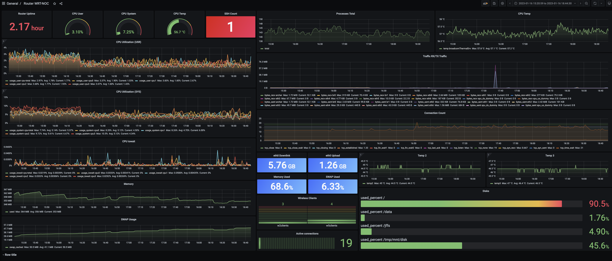
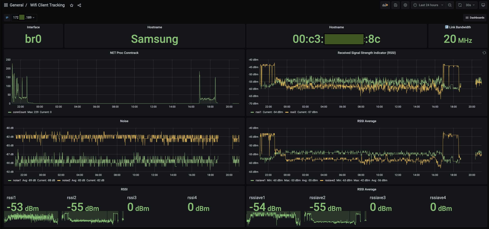

# wrt-noc
AsusWRT Merlin and DD-WRT Metrics with Docker composer and Telegraf agent

## Overview
This project provides a way to collect router metrics and visualize them using **InfluxDB** and **Grafana**. The metrics are collected using **Telegraf** and sent to the InfluxDB server, which is set up using Docker Compose. The project supports both **Asuswrt Merlin** and **DD-WRT** firmware.

## Prerequisites
**Router:** AsusWRT Merlin or DD-WRT firmware 
**Router:** Entware and Telegraf installed 
**Router:** For RSSI monitoring, the 'wl' command is necessary 
**Server:** Virtual Machine (e.g. AWS, Oracle Ampere Cloud) 
**Server:** Docker and Docker Compose installed 

## Tested Routers
**Asus RT-AX56U V1** (AsusWRT Merlin firmware) 
**Linksys WRT3200ACM** (DD-WRT firmware) - Note: RSSI monitoring may not work on this router due to the Marvell chip. 

## Limitations
RSSI monitoring is limited to routers with Broadcom chips.

## Installation
#### Server Installation
1. Install Docker and Docker Compose on a virtual machine (e.g. Ampere Cloud).
2. Clone this repository to the virtual machine.
3. In the cloned repository, configure the **docker-compose.yml** file by setting the following environment variables:

``DOCKER_INFLUXDB_INIT_USERNAME`` 
``DOCKER_INFLUXDB_INIT_PASSWORD`` 
``DOCKER_INFLUXDB_INIT_ADMIN_TOKEN`` 

4. Also in the docker-compose.yml file, configure the external IP of the virtual machine and set the the same '**url**' parameter in "**datasources/influxdb2.yml**"
5. Run **docker-compose up -d** to start the InfluxDB and Grafana servers.

#### Router Installation
1. Install **[Entware](https://github.com/Entware/Entware)**. on your router.
2. SSH into the router and use the package manager (opkg) to install Telegraf.
3. Copy the two files "**telegraf/extraInfo.sh**" and "**telegraf/telegraf.config**" from the cloned repository to the router.
4. In the "telegraf/extraInfo.sh" file, set the mode to either ASUSWRT or DDWRT to collect additional data that Telegraf cannot provide. Customize this file as desired.
5. In the "telegraf/telegraf.config" file, set the "token" to the value of DOCKER_INFLUXDB_INIT_ADMIN_TOKEN and the 'urls' to the IP of the server.
6. Customize the 'inputs.exec' where 'bash **/path/to/extraInfo.sh**' to define the proper path to extraInfo.sh.
7. Start Telegraf on the router

``telegraf --config telegraf.config``

## Security
For optimal security, it is highly recommended to change the default passwords and SSL keys as soon as the project is installed. The default passwords and keys are located in the "ssl" directory and can be easily changed by following these steps:

1. Locate the "ssl" directory in the project's file structure.
2. Replace the default password and keys with new, strong and unique passwords and keys.
3. Make sure to use a strong password generator to create your new password, you can use online tool or a password manager to generate them.
4. Store the new passwords and keys in a secure location, such as a password manager, and do not share them with anyone.

By taking these simple steps, you can greatly enhance the security of your project and protect it from potential vulnerabilities. It is also important to note that you should change the passwords and keys regularly to ensure that they remain secure.

## License
This project is licensed under the MIT License. 
 
Author: Maksymilian Arciemowicz 

## RSSI Dashboard

